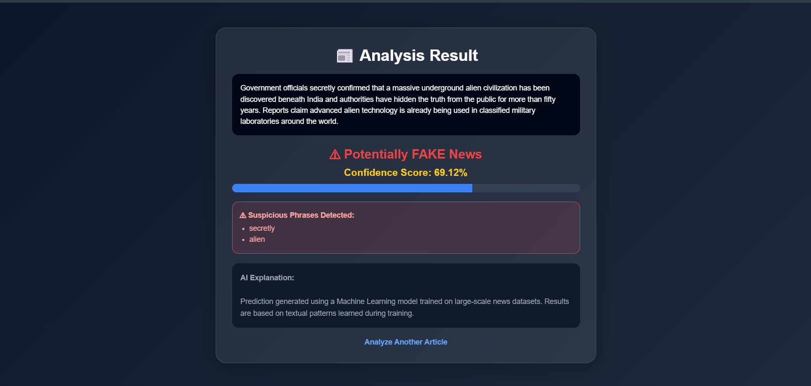
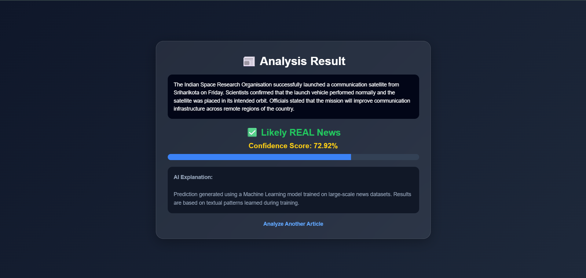
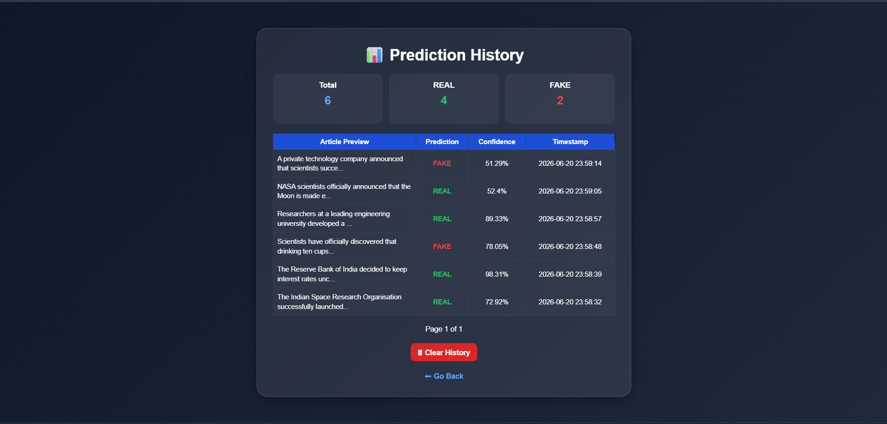

# TruthLens AI | Fake News Detection System

An intelligent web application that detects whether a news article is **REAL** or **FAKE** using **Machine Learning** and **Natural Language Processing (NLP)**.
The application analyzes user-provided news content, predicts authenticity, provides confidence scores, detects suspicious keywords, and stores prediction history for future analysis.

---

## Project Overview

The spread of fake news and misinformation on digital platforms has become a major challenge in today's world.
This project helps identify misleading or false news articles by training a machine learning model on real-world news datasets and deploying it as an interactive web application using Flask.

Users can paste any news article and instantly receive a prediction result with confidence score and additional keyword-based analysis.

---

## Features

* Detects whether news is **REAL** or **FAKE**
* Machine Learning based text classification
* Text preprocessing and cleaning pipeline
* Confidence score prediction
* Suspicious keyword detection
* Stores prediction history using SQLite database
* Prediction history with pagination
* Analytics for REAL and FAKE predictions
* Clear history functionality
* Modern responsive user interface

---

## Tech Stack

### Backend

* Python
* Flask
* SQLite Database

### Machine Learning

* Scikit-learn
* TF-IDF Vectorization
* Multinomial Naive Bayes Classifier
* Natural Language Processing (NLP)

### Frontend

* HTML5
* CSS3
* JavaScript

---

## Project Structure

```bash
SmartFakeNewsDetector/
│── app.py
│── train_model.py
│── requirements.txt
│── README.md
│── .gitignore
│
│── dataset/
│   ├── Fake.csv
│   └── True.csv
│
│── models/
│   ├── model.pkl
│   └── vectorizer.pkl
│
│── templates/
│   ├── index.html
│   ├── result.html
│   └── history.html
│
│── static/
│   ├── css/
│   │   └── style.css
│   ├── js/
│   │   └── main.js
│   └── screenshots/
│       ├── home-page.png
│       ├── fake-result.png
│       ├── real-result.png
│       └── history-page.png
│
│── utils/
│   ├── predictor.py
│   ├── database.py
│   └── helpers.py
│
│── history.db
```

---

## Screenshots

### Home Page


Main interface where users can enter news content for analysis.

---

### Fake News Detection



Displays prediction result, confidence score, and suspicious keyword detection when fake news is detected.

---

### Real News Detection



Displays REAL news prediction with confidence score.

---

### Prediction History



Stores previous predictions with analytics and history management using SQLite database.

---

## Machine Learning Workflow

1. Load fake and real news datasets
2. Assign labels to both datasets
3. Merge datasets into one dataframe
4. Clean and preprocess text data
5. Convert text using TF-IDF Vectorization
6. Train model using Multinomial Naive Bayes
7. Evaluate model performance
8. Save trained model and vectorizer
9. Load model in Flask application for real-time prediction

---

## Installation

Clone repository

```bash
git clone <your-repository-link>
cd SmartFakeNewsDetector
```

Install dependencies

```bash
pip install -r requirements.txt
```

Train the model

```bash
python train_model.py
```

Run Flask application

```bash
python app.py
```

Open browser

```bash
http://127.0.0.1:5000
```

---

## Model Performance

Model trained using:

* TF-IDF Vectorization
* Multinomial Naive Bayes Classifier

Achieved approximately:

* Accuracy: ~97% to 98%
* Balanced classification between REAL and FAKE news articles

---

## Application Workflow

1. User enters a news article
2. Text is cleaned and preprocessed
3. TF-IDF converts text into numerical vectors
4. Model predicts REAL or FAKE
5. Confidence score is generated
6. Suspicious keywords are detected
7. Prediction is stored in SQLite database
8. User can review previous prediction history

---

## Future Improvements

* News URL based detection
* Real-time fact-check API integration
* Dashboard with charts and analytics
* User authentication system
* Deep learning models such as LSTM or BERT
* Multi-language fake news detection

---

## Learning Outcomes

This project helped in understanding:

* Machine Learning model development
* Natural Language Processing techniques
* Text preprocessing and feature extraction
* Flask web application development
* SQLite database integration
* End-to-end ML project deployment
* Modular Python project architecture

---

## Author

**CH Bhanu Prakash**

GitHub: https://github.com/bhanuprakash2508
LinkedIn: https://linkedin.com/in/bhanuprakash-chintha

---
